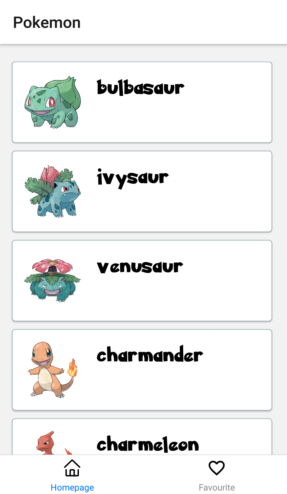
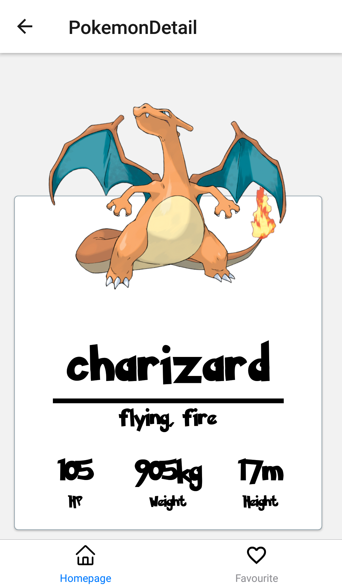

# Pokedex
Pokemon App in ReactNative

<h2>Screenshots</h2>
<h4>Homepage(Pokemon List)</h4>

<h4>Pokemon Detail</h4>

<h2>Features</h2>
<ul>
    <li>Https request(networking)</li>
    <li>Using Redux(Global Store)</li>
</ul>

<h2>How to use/install</h2>
<ul>
    <li>Clone or dowload from repo</li>
    <li>Goto folder and install dependency packages (npm install)</li>
    <li>After install then start the project (expo start)</li>
</ul>

<h2>Credits</h2>
<h4>API</h4>

https://pokeapi.co/

<h4>Images</h4>

https://pokeres.bastionbot.org/

<h4>Fonts</h4>

https://fontsly.com/fancy/cartoon/pokemon/

